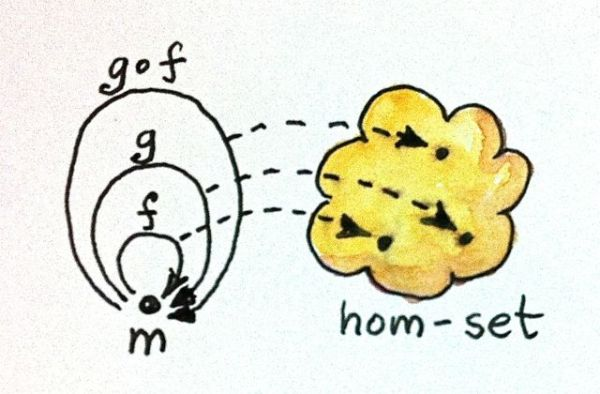

Categories Great and Small
=================================

* No Objects
* Before talking of Categories with one single object (Monoids) let's talk about Orders and hom-sets
* Building a Free Category
    * **Do**: deepen the topic
* Orders
    * Kind of orders
        * Preorder or Quasiorder
            * Category where morphism is "is less than or equal to"
                * Let's check if a Preorder is a Category
                    * Is there the Identity morphism?
                    * Is Composition defined?
                    * Is Composition associative?
                * There can be cycles
            * **Do**: make an example
                * Reachability
                * `x <= y if f(x) <= f(y)`
        * Partial Order (also called *poset*)
            * A pre-order with the additional condition
            ```haskell
              if a <= b and b <= a then a = b
            ```
            * **Do**: make an example
        * Total Order or Linear Order
    * Orders as Categories
        * Let's define first the Hom-set
            * Give two objects `a` and `b` in a Category `C` the *Hom-set* `C(a, b)` is the set of morphisms from object `a` to object `b`
        * A Preorder is a Category where there is at most one morphism from an object `a` to an object `b`
            * That is, every hom-set in a Preorder is either empty or singleton
                * This includes the hom-set `C(a, a)`, which is singleton as it includes the identity
            * It's *thin category*
        * In a partial order (poset)
            * every hom-set is either empty or singleton
            * There are no cycles (**Do** how to express this?)
                * if there is a morphism from xx to yy and a morphism from yy to xx (which by the above implies that xx and yy are isomorphic), then x=yx = y. see [ncatlab](https://ncatlab.org/nlab/show/partial+order#AsACategoryWithExtraProperties)
        * In a Total order all the hom-sets are singleton **Do** Verify
* Monoids
    * In Set Theory:
        * In Set Theory, a Monoid is a Set with a binary, associative operation
            * A Monoid is an algebraic structure 
                * with a single associative binary operation 
                * and an identity element. (Wikipedia)
        * Examples
            * natural numbers form a Monoid under addition
                * it is associative
                ```haskell
                  (a + b) + c = a + (b + c)
                ```
                * The identity (the neutral element) is 0
                ```haskell
                  a + 0 = a
                ```
        * In Haskell
        ```haskell
        class Monoid m where
            mempty :: m
            mappend :: m -> m -> m
        ```
            * `mempty` defines the identity  (or the neutral) element
            * `mappend` is the binary function
    * In Categoty Theory
        * A monoid is a a Category

        * We could replace elements of the set (natural numbers) with functions
            * add3, the function that adds 3, and so on
                * such functions associate an element m to a function m -> m
                * this reminds of the type of 
                ```haskell
                    mappend :: m -> m -> m
                ```
                which we could reformulate as
                ```haskell
                    mappend :: m-> (m -> m)
                ```
                to highlight that they associate numbers to adder functions
        * It's a Category with a single object
        * Is it always true that a categorical monoid defines a unique set-monoid, that is a set with binary, associative operation with an identity element?. That is, can we always recover a set monoid from a categorical monoid?
            * Yes. 
                * Consider the hom-set `M(m, m)` of a categorical monoid `M`.
                    * in our examples, they are the adders (`add3`, `add50`, `add0`)
                * take two morphisms `f` and `g` from that set
                * they can always be composed
                * the identity element exists, since it is `add0`
                * Therefore, we can always define a binary operation in that set, as the product of two element in the set (that is, the composition of the morphisms in the category world)
                

            
